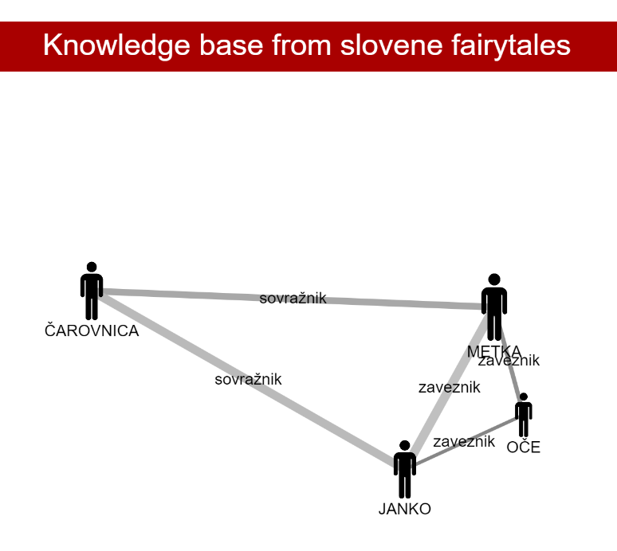

# Natural language processing course 2022/23: `Character analysis in Slovene short stories`

## Environment setup
To install all required dependencies for this project run: \
```pip install -r requirements.txt```

To prepare the environment for the NER process you need to execute the following command in python (this downloads the NER, POS and lemma models from classla that are required for this process): \
```python -c "import classla; classla.download('sl')"```

TODO: Add env setup for coreference

 <!-- Visualization and evaluation don't need any aditional libraries. -->

## Component usage
This section describes the general pipeline and structure of our repo. Before this make shur that the environment is set up.

### Name entity recognition
To use the ner pipeline for stories we can follow the example in `calculate_ner.py`. We first need to initialize the classla model (the easiest way to do that is just to construct a pipeline that includes processor tokenizer, ner, pos and lemma). After that we need to have a txt file of all predefined characters to search for (can be located in `src/resources/characters.txt`). We then input all those values into find_all_entities function (located in `src/name_entity_recognition.py`). The output of the function is a dictionary which has characters for keys and a list of tuples that represent occurrences of those entities in the text as values.
### NER evaluation

### Coreference resolution
From https://www.clarin.si/repository/xmlui/handle/11356/1773 download the model and use code (common.py, data.py, metrics.py, utils.py and contextual_model_bert.py) from the https://github.com/clarinsi/SloCOREF. Put all files into the directory from clarin and run coreference function from the coreference.py file. The input parameter of the voreference function:
* text - the text the model predicts the coreference
* filename - json file that contains dictionary of entities from the name recognition and its starting/ending positions
* trust - the threshold for the mention score
* window_size - the length of the substring of a text
* offset - the offset of the start of the next substring
* deviation - the deviation around the position of the entity

The output of the function is the modified dictionary of the entities and its starting/ending positions.

### Visualization
To initiate the visualization, access your terminal and navigate to the directory where the project is stored (*nlp-course-neznaniletecipredmet*). Execute the command `python -m http.server 8000` and proceed to open your preferred web browser and access `http:localhost:8000`.

## Example results

The following results were obtained for the story *Janko in Metka*.
Mean and standard deviation were utilized to report on the precision and recall of the outputs obtained from both the named entity recognition (NER) and coreference models.
```
ner precision: (0.8084, 0.0457)
ner recall: (0.9591, 0.0234)
crr precision: (0.8039, 0.047)
crr recall: (0.9067, 0.0299)
ner words precision: (0.0, 0.0)
ner words recall: (0.0, 0.0)
```

  


# TODOs:
* Jana add coreference module to repo
* Implement the relationship extraction
* Implement the relationship classification
* Implement character classification
* Implement the protagonist classification
* Implement character feature extraction
